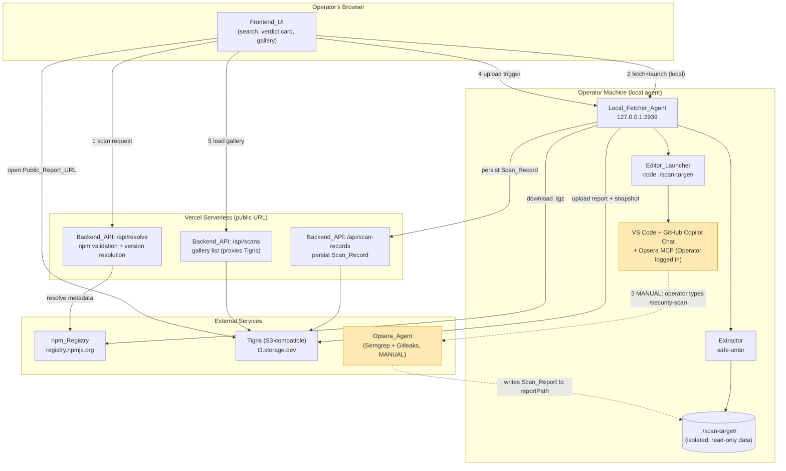
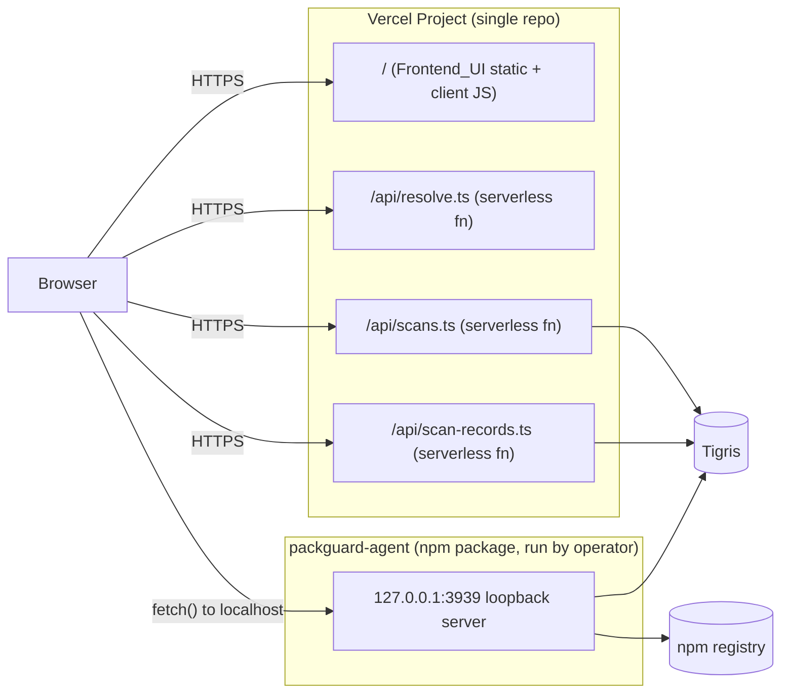

# Design Document

## Overview

PackGuard lets a developer check whether an npm package is safe **before** installing it. A user types a package name into a Vercel-hosted UI; PackGuard fetches the package source directly from the npm registry, **safely unpacks it without ever installing or executing it**, opens it in VS Code, and an operator triggers Opsera's DevSecOps Security Scan Agent (`/security-scan` in GitHub Copilot Chat). The resulting report is normalized, scored, stored in Tigris object storage, and presented as a SAFE/RISKY verdict card with the actual risky code lines plus a public shareable link. Over time, the set of scanned packages forms a browsable gallery.

The defining safety property is **"inspect without installing"**: PackGuard only downloads the `.tgz` tarball and *reads* its contents. It never runs `npm install`, never executes lifecycle scripts, and never imports, requires, or evaluates any fetched file. Reading code is safe; running it is not.

Because **Opsera has no API and no CLI**, the scan itself is a manual human action performed inside VS Code by an operator who is logged into Opsera. PackGuard automates everything *around* the scan — fetch, safe-untar, VS Code launch, report normalization, upload, gallery — but the scan trigger is a deliberate human step. This is positioned honestly as **automated static security review and risk scoring before install** (Opsera runs Semgrep + Gitleaks static analysis), not behavioral malware detection.

### The Two Hard Architectural Forces

Two facts drive every structural decision in this design:

1. **The manual scan handoff.** The scan is a human typing `/security-scan` in Copilot Chat. No code path can invoke it. The architecture must split cleanly into *automated-before*, *manual-middle*, and *automated-after* phases, with a durable contract that survives the human pause in the middle.
2. **The serverless filesystem constraint.** Vercel functions have no persistent server-side disk (only an ephemeral `/tmp`) and cannot launch the operator's local VS Code ([Vercel Functions Limits](https://vercel.com/docs/functions/limitations)). The tarball download, safe extraction into `./scan-target/`, and `code ./scan-target/` launch are therefore **operator-local** responsibilities, while npm resolution, Tigris storage, the gallery, and public URLs are **serverless**.

This produces a **hybrid topology**: a thin serverless layer on Vercel plus a small operator-local agent. The two are bridged by a single JSON contract (`Scan_Result_Contract`) and a normalized `Report_Schema`.

### Workstream Mapping

The design is organized so three people work in parallel against fixed interface contracts:

- **Person A — Fetcher + Backend** owns the `Local_Fetcher_Agent` (download, `Extractor`, `Editor_Launcher`) and the serverless `Backend_API` surface that produces the `Scan_Result_Contract` and exposes the upload trigger.
- **Person B — Storage + Frontend** owns the `Storage_Service` (Tigris upload/list/public-URL), the `Frontend_UI` (search, verdict card, gallery), and the **shared `Report_Schema` + verdict-threshold rule** that both sides depend on.
- **Person C — Daytona Experiment** runs an independent, non-blocking feasibility spike. It produces a written deliverable and must not modify A's or B's behavior.

The contracts in [Components and Interfaces](#components-and-interfaces) are the seams: once they are agreed, A and B can build against stubs without waiting on each other.

## Architecture

### Deployment Topology



The dotted edges (`3`) are the **manual handoff**: nothing in PackGuard can cross them programmatically. Everything before and after is automated.

### Why the Backend_API Is Split (Serverless + Local)

| Capability | Where it runs | Why |
|---|---|---|
| Package-name validation, npm version resolution | **Serverless** (`/api/resolve`) | Pure network I/O; fast; satisfies Req 16.3 (respond < 10s). |
| Tarball download, safe-untar, `./scan-target/` | **Local agent** | Needs a real persistent filesystem; the operator's VS Code opens this exact local folder. Serverless `/tmp` is ephemeral and invisible to the operator's editor. |
| `code ./scan-target/` launch + operator prompt | **Local agent** | The `code` CLI and the operator's VS Code/Opsera session exist only on the operator's machine. |
| Upload trigger (read local report, push to Tigris) | **Local agent** | `reportPath` is a local file Opsera wrote; serverless cannot read the operator's disk, and Vercel's 4.5 MB request-body limit makes streaming snapshots through a function fragile ([Vercel body-size guide](https://vercel.com/guides/how-to-bypass-vercel-body-size-limit-serverless-functions)). |
| Persist `Scan_Record`, list gallery, serve public URLs | **Serverless + Tigris** | Small JSON + object reads; Tigris public buckets serve report URLs directly without auth. |

This split is the honest consequence of the two hard forces. It is called out again under [Design Considerations](#design-considerations-manual-handoff--serverless-constraints).

### End-to-End Flow (including the manual handoff)

```mermaid
sequenceDiagram
    actor User as Operator
    participant UI as Frontend_UI (Vercel)
    participant API as Backend_API (Vercel)
    participant Agent as Local_Fetcher_Agent
    participant NPM as npm_Registry
    participant Code as VS Code + Opsera
    participant Store as Storage_Service (Tigris)

    User->>UI: enter package name, click Scan
    UI->>API: POST /api/resolve {packageName}
    API->>NPM: resolve metadata + version
    NPM-->>API: {version, tarballUrl, integrity}
    API-->>UI: resolution result (<10s)

    UI->>Agent: POST /local/fetch {packageName, version, tarballUrl}
    Agent->>NPM: download .tgz (no exec)
    Agent->>Agent: safe-untar into ./scan-target/ (read-only data)
    Agent->>Code: code ./scan-target/
    Agent-->>UI: Scan_Result_Contract {packageName, version, sourcePath, reportPath}
    UI-->>User: "Run /security-scan in Copilot Chat"

    Note over User,Code: ⏸ MANUAL HANDOFF — operator types /security-scan;<br/>Opsera (Semgrep+Gitleaks) writes Scan_Report to reportPath

    User->>UI: click "Upload report"
    UI->>Agent: POST /local/upload (upload trigger)
    Agent->>Agent: read reportPath, normalize to Report_Schema, derive verdict
    Agent->>Store: upload Scan_Report + Source_Snapshot
    Agent->>API: POST /api/scan-records {Scan_Record}
    API->>Store: persist Scan_Record + Public_Report_URL
    Store-->>UI: success
    UI-->>User: verdict card (SAFE/RISKY, score, findings, link)

    User->>UI: open gallery
    UI->>API: GET /api/scans
    API->>Store: list Scan_Records (<=100)
    Store-->>UI: gallery
```

### Component Responsibilities (high level)

- **Frontend_UI** (Vercel, Person B): search + Scan control, in-progress/timeout handling, verdict card with findings and code lines, shareable link, gallery, honest-framing labels and disclaimer.
- **Backend_API** (Vercel + local, Person A): `/api/resolve` (serverless), the `Local_Fetcher_Agent` HTTP interface (local), the `Scan_Result_Contract`, and the upload-trigger interface.
- **Local_Fetcher_Agent** (Person A): orchestrates download → `Extractor` → `Editor_Launcher`, enforces all "inspect without installing" safety rules, and runs the upload trigger.
- **Extractor** (Person A): path-traversal-safe tar extraction into `Scan_Target_Directory`.
- **Editor_Launcher** (Person A): `code ./scan-target/` launch and operator prompt.
- **Storage_Service** (Tigris, Person B): upload report + snapshot, mint public URLs, list records, persist `Scan_Record`.
- **Report normalizer + verdict deriver** (shared logic, Person B owns the schema; runs in the upload trigger): maps raw Opsera output → `Report_Schema` with fail-safe defaults and derives the verdict.
- **Daytona experiment harness** (Person C): records timed step outcomes and produces the feasibility deliverable.

## Components and Interfaces

This section defines the **interface contracts** that let Person A, B, and C work in parallel. Each contract is a fixed seam; once agreed, each side can build against a stub of the other.

### Interface 1 — Scan_Result_Contract (Person A → Person B)

Produced by the `Local_Fetcher_Agent` after successful extraction (Req 6.1). It is the handshake telling Person B where the report will land and what was scanned.

```typescript
interface ScanResultContract {
  packageName: string;   // non-empty; the resolved package (supports @scope/name)
  version: string;       // non-empty; the exact resolved version
  sourcePath: string;    // absolute local path to ./scan-target/ (the extracted source)
  reportPath: string;    // absolute local path where the Operator's Scan_Report is expected
}
```

Rules:
- All four fields MUST be non-empty when extraction succeeds (Req 6.1).
- `reportPath` is the agreed location the operator/Opsera writes the report to (Req 6.2). PackGuard pre-computes it (e.g. `./scan-target/.packguard/report.json`) so the upload trigger knows where to look.
- The contract is returned to the `Frontend_UI` from the local fetch call and held in UI state across the manual handoff.

### Interface 2 — Local_Fetcher_Agent HTTP API (Person A)

A small loopback HTTP server (`http://127.0.0.1:3939`) on the operator's machine. The serverless UI calls it for the filesystem-bound steps. Bound to localhost only; it never exposes the operator's disk to the public internet.

```
POST /local/fetch
  body:  { packageName: string, version?: string, tarballUrl: string, integrity?: string }
  200:   ScanResultContract
  4xx/5xx: { errorType: FetchErrorType, message: string, manualCommand?: string }

POST /local/upload          // the upload-trigger interface (Interface 3)
  body:  { uploadId: string }   // references the active ScanResultContract
  200:   { scanRecord: ScanRecord }
  4xx/5xx: { errorType: UploadErrorType, message: string }

GET  /local/health
  200:   { status: "ok", codeCliAvailable: boolean }
```

`FetchErrorType` enumerates the failure modes from Reqs 1–5: `INVALID_PACKAGE_NAME`, `PACKAGE_UNRESOLVED`, `VERSION_UNRESOLVED`, `REGISTRY_UNAVAILABLE`, `DOWNLOAD_FAILED`, `DOWNLOAD_TOO_LARGE`, `PATH_TRAVERSAL`, `ABSOLUTE_PATH`, `LINK_TARGET_ESCAPE`, `RESOURCE_LIMIT_EXCEEDED`, `EXTRACTION_TIMEOUT`, `VSCODE_UNAVAILABLE`, `VSCODE_LAUNCH_FAILED`. The three link/path violation types are kept **distinct** (Reqs 4.2–4.5).

### Interface 3 — Upload-Trigger Interface (Person A ↔ Person B)

The callable interface the `Frontend_UI` invokes after the manual scan (Req 6.7). Implemented as `POST /local/upload` because reading `reportPath` requires the operator's disk.

Behavior (Req 6.3–6.6):
- If a report exists at `reportPath`: normalize it to `Report_Schema`, derive the verdict, hand the `Scan_Report` + `Source_Snapshot` to the `Storage_Service`, then return success once storage confirms.
- If no report exists at `reportPath`: return `REPORT_MISSING` and do **not** call the `Storage_Service` (Req 6.5).
- If the `Storage_Service` does not confirm within 30s or fails: return `UPLOAD_FAILED` and retain the report at `reportPath` (Req 6.6).

`UploadErrorType`: `REPORT_MISSING`, `INVALID_IDENTIFIER`, `UPLOAD_FAILED`, `INVALID_RISK_SCORE`.

### Interface 4 — Storage_Service API (Person B)

The `Storage_Service` wraps Tigris (S3-compatible, endpoint `https://t3.storage.dev`, via `@aws-sdk/client-s3`). It is consumed by the upload trigger (writes) and the gallery (reads).

```typescript
interface StorageService {
  // Req 7: upload report + snapshot, persist record
  uploadScan(input: {
    report: ReportSchema;          // normalized, already conforms to Report_Schema
    reportBytes: Buffer;           // raw report artifact to store (HTML/MD/JSON)
    sourceSnapshot: Buffer;        // archived ./scan-target/ source
  }): Promise<{ scanRecord: ScanRecord }>;

  // Req 8: public URL minted on upload; included in record when available
  getPublicReportUrl(packageName: string, version: string): Promise<string | null>;

  // Req 9: gallery list interface (Interface 5)
  listScans(input?: { limit?: number }): Promise<GalleryResult>;
}
```

Tigris object key layout (Reqs 7.3–7.4 require keys to include name + version):
```
reports/{encodedName}/{version}/report.json     -> Public_Report_URL target
sources/{encodedName}/{version}/source.tgz       -> Source_Snapshot
records/{encodedName}/{version}.json             -> Scan_Record
```
`encodedName` URL-encodes `@scope/name` so scoped packages map to safe keys (Req 1.6).

### Interface 5 — Gallery / List Interface (Person B)

```typescript
interface GalleryResult {
  records: ScanRecord[];     // up to 100 (Req 9.1); one entry per scanned version (Req 9.3)
  partial: boolean;          // true if some records could not be retrieved (Req 9.4)
  unavailable: boolean;      // true only when the data store is fully unavailable (Req 9.8)
}
```
Exposed to the UI as `GET /api/scans` (serverless). Semantics:
- Empty store → `{ records: [], partial: false, unavailable: false }` (Req 9.6); UI shows "no scanned packages" (Req 9.7).
- Some records fail to load → return the rest with `partial: true` (Req 9.4).
- Store unreachable → `unavailable: true`, no partial data (Req 9.8).

### Frontend_UI (Person B)

- **Search + Scan control** (Req 10): accepts 1–214 chars; rejects empty/whitespace with a "package name required" validation message (Req 10.3); disables control + shows progress during a request (Req 10.4); re-enables on success/error/timeout (Reqs 10.5–10.7); retains input on error (Reqs 10.6, 16.4).
- **Verdict card** (Req 11): shows `Verdict` + `riskScore` (0–100 integer); every finding with category, filePath, lineNumber, and the referenced source line; "source line unavailable" fallback (Req 11.7); SAFE-with-zero-findings message (Req 11.5); shareable `Public_Report_URL` with "link unavailable" fallback (Req 11.8); "no report available" message (Req 11.6).
- **Gallery** (Req 9): renders each record's name, version, verdict, score, and report link; clicking opens the `Public_Report_URL`.
- **Honest framing** (Req 17): labels results as "automated static security review and risk scoring"; shows Opsera/static-analysis attribution; shows the disclaimer that static analysis does not detect runtime/behavioral threats; the verdict text excludes any "behavioral/dynamic/runtime/malware detection" terminology. A small shared `framing.ts` constants module centralizes approved copy so this is enforced in one place.

### Editor_Launcher (Person A)

- On successful extraction, runs `code ./scan-target/` within 10s (Req 5.1) and the UI shows the `/security-scan` prompt (Req 5.2).
- If `code` is absent: return `VSCODE_UNAVAILABLE`, state the manual open command, and **retain** `./scan-target/` (Req 5.3).
- If `code` exists but launch fails/times out: return `VSCODE_LAUNCH_FAILED`, state the manual command, retain `./scan-target/` (Req 5.4).
- `GET /local/health` reports `codeCliAvailable` so the UI can warn early.

### Daytona Experiment Harness (Person C)

Independent and non-blocking (Reqs 14–15). It does **not** import or modify `Fetcher_Service`, `Storage_Service`, or `Frontend_UI` code (Req 14.5). It drives timed steps and records outcomes:

```typescript
interface DaytonaStepResult {
  step: "SANDBOX_SPINUP" | "REMOTE_SSH" | "INSTALL_COPILOT"
      | "INSTALL_OPSERA_MCP" | "OPSERA_OAUTH";
  outcome: "SUCCESS" | "FAILURE" | "NOT_ATTEMPTED";
  timeoutSeconds: number;       // 120 / 60 / 300 / 300 / 120 respectively
  completedAt: string | null;   // UTC ISO timestamp
  observedReason?: string;      // required on FAILURE (incl. timeout-exceeded)
}
```
Dependent steps are marked `NOT_ATTEMPTED` when a prerequisite fails (Req 15.6). The deliverable is a Markdown document: YES/NO conclusion with evidence (Req 14.1), reproduction steps and the local→Daytona fetch-swap plan if YES (Reqs 14.2–14.3), or documented blockers if NO (Req 14.4).

## Data Models

### Report_Schema (shared Person A ↔ Person B, Req 12)

The normalized report both sides agree on. Raw Opsera output (HTML/MD/JSON from Semgrep + Gitleaks) is mapped into this shape by the normalizer in the upload trigger.

```typescript
type Verdict   = "SAFE" | "RISKY";                       // case-sensitive (Req 12.3)
type Severity  = "LOW" | "MEDIUM" | "HIGH" | "CRITICAL";  // ordered (Req 12.7)

interface Finding {
  category:   string;   // 1..100 chars       (Req 12.2)
  filePath:   string;   // 1..4096 chars
  lineNumber: number;   // integer >= 0; 0 = unspecified line
  severity:   Severity;
  codeSnippet: string;  // 0..1000 chars; the actual risky source line(s)
}

interface ReportSchema {
  packageName: string;     // 1..214 chars   (Req 12.1)
  version:     string;     // 1..256 chars
  verdict:     Verdict;
  riskScore:   number;     // integer 0..100 inclusive (Reqs 12.6, 13.1)
  findings:    Finding[];  // 0..1000 items
}
```

**Fail-safe defaults (Req 12.5).** When a raw report omits a field, the normalizer fills it with the *safe* (pessimistic) default so missing data never reads as "safe":

| Missing field | Default |
|---|---|
| `verdict` | `RISKY` |
| `riskScore` | `100` |
| `findings` | `[]` |
| `severity` (within a finding) | `CRITICAL` |
| `lineNumber` (within a finding) | `0` |
| any required string (`packageName`, `version`, `category`, `filePath`) | placeholder value (e.g. `"unknown"`) |

**Verdict derivation (Req 13).** A single threshold `T` (a constant in the range 0–100, default `T = 50`) separates verdicts:
- `riskScore < T` → `SAFE` (Req 13.2)
- `riskScore >= T` → `RISKY` (Req 13.3)
- Derivation is a pure function of `(riskScore, T)` → deterministic (Req 13.4).
- If `riskScore` is missing or outside 0–100, reject with `INVALID_RISK_SCORE`; no verdict assigned (Req 13.6). Note: the fail-safe default (`riskScore = 100`) applies to *normalization of an absent field*; a *present but out-of-range* score is an error per 13.6. Order of operations: apply 12.5 defaults first, then validate range per 13.6.

The threshold is recorded into each `Scan_Record` at creation time so later threshold changes do not retroactively alter stored verdicts (Req 13.5).

### Scan_Record (persisted in Tigris, Req 7.5)

```typescript
interface ScanRecord {
  packageName:    string;          // 1..214 chars
  version:        string;          // 1..256 chars
  verdict:        Verdict;         // frozen at creation (Req 13.5)
  riskScore:      number;          // 0..100
  thresholdUsed:  number;          // the T applied when this record was created
  publicReportUrl: string | null;  // null if URL generation failed (Reqs 8.2, 11.8)
  reportKey:      string;          // Tigris key: reports/{encodedName}/{version}/report.json
  sourceKey:      string;          // Tigris key: sources/{encodedName}/{version}/source.tgz
  createdAt:      string;          // UTC ISO 8601 timestamp
}
```

Stored as JSON at `records/{encodedName}/{version}.json`. The gallery lists these objects (Req 9). Multiple versions of the same package each get their own record (Req 9.3).

### Resolution & internal fetch models (Person A, internal)

```typescript
interface ResolvedPackage {        // output of /api/resolve
  packageName: string;
  version:     string;             // latest if unspecified (Req 1.2), else exact (Req 1.3)
  tarballUrl:  string;
  integrity?:  string;             // shasum/integrity from npm metadata
}

interface SafeTarLimits {          // enforced by Extractor (Reqs 2.4, 3.8)
  maxTarballBytes:      100_000_000; // 100 MB compressed download cap (Req 2.4)
  maxUncompressedBytes: 250_000_000; // 250 MB total uncompressed (Req 3.8)
  maxEntryCount:        10_000;      // entry-count cap (Req 3.8)
}
```

### Configuration / environment

| Variable | Owner | Purpose |
|---|---|---|
| `TIGRIS_ENDPOINT` (`https://t3.storage.dev`), `AWS_ACCESS_KEY_ID`, `AWS_SECRET_ACCESS_KEY`, `TIGRIS_BUCKET` | B | Tigris S3 client + bucket |
| `RISK_THRESHOLD` (default `50`) | B | Verdict threshold `T` |
| `LOCAL_AGENT_PORT` (default `3939`) | A | Loopback agent port |
| `SCAN_TARGET_DIR` (default `./scan-target`) | A | Isolated extraction root |
| `NPM_REGISTRY_BASE` (default `https://registry.npmjs.org`) | A | Registry base URL |

## Correctness Properties

*A property is a characteristic or behavior that should hold true across all valid executions of a system — essentially, a formal statement about what the system should do. Properties serve as the bridge between human-readable specifications and machine-verifiable correctness guarantees.*

PBT is appropriate for PackGuard because its core risk surfaces are **pure logic**: the safe-tar containment algorithm, report normalization (a parser/serializer — always round-trip it), fail-safe defaulting, verdict derivation, key construction, retry policy, and render completeness. Infrastructure concerns (npm/Tigris/Vercel/Opsera/Daytona wiring) are covered by integration, smoke, and example tests instead — see [Testing Strategy](#testing-strategy). The properties below are the consolidated, de-duplicated set from the prework.

### Property 1: Inspect without installing — no fetched code is ever executed

*For any* generated package (including ones containing `index.js`, native binaries, and `package.json` with arbitrary `preinstall`/`install`/`postinstall` lifecycle scripts), running the full fetch + extract pipeline never invokes a package-manager install command and never executes, imports, requires, or evaluates any extracted file (spies on `child_process.spawn/exec`, `require`, dynamic `import`, `eval`, and `vm` record zero invocations against fetched content).

**Validates: Requirements 2.5, 3.1, 3.2, 3.3, 3.4, 3.5**

### Property 2: Extraction containment

*For any* tarball whose entries all resolve safely, every entry actually written has a fully resolved canonical path equal to or a descendant of the canonical path of the `Scan_Target_Directory`.

**Validates: Requirements 4.1, 3.1**

### Property 3: Malicious-entry detection with distinct violation types and full rollback

*For any* tarball containing at least one unsafe entry, the `Extractor` aborts, reports the correct **distinct** violation type — path-traversal (`../` escape), absolute-path (leading `/` or drive root), or link-target-escape (symlink/hardlink target outside, or an intermediate path component that is a symlink resolving outside) — and leaves zero files or directories from that tarball on disk.

**Validates: Requirements 3.6, 4.2, 4.3, 4.4, 4.5**

### Property 4: Resource-limit abort

*For any* tarball whose cumulative uncompressed size exceeds 250 MB or whose entry count exceeds 10,000, the `Extractor` aborts with a resource-limit violation before fully materializing the archive; tarballs within both bounds extract without a resource-limit error.

**Validates: Requirements 3.8, 2.4**

### Property 5: Isolation across scans (clean before and after)

*For any* sequence of scans, each scan begins with a `Scan_Target_Directory` containing zero carried-over entries, and after each scan completes — whether it succeeded or was aborted by a violation — the `Scan_Target_Directory` contains zero entries from that package.

**Validates: Requirements 4.6, 4.7**

### Property 6: Package-name validation and scoped-name handling

*For any* candidate package name, the validator accepts it if and only if it satisfies npm naming constraints (non-empty, ≤ 214 characters, permitted characters, including `@scope/name` form); names judged invalid are rejected before any `npm_Registry` query, and any accepted scoped name encodes to a registry/Tigris key that decodes back to the original name.

**Validates: Requirements 1.6, 1.7**

### Property 7: Version resolution

*For any* npm metadata, a request without a version resolves to the version the registry designates as latest (`dist-tags.latest`), and a request for a version present in the metadata resolves to exactly that version.

**Validates: Requirements 1.2, 1.3**

### Property 8: Scan_Result_Contract completeness

*For any* successful scan, the produced `Scan_Result_Contract` has non-empty `packageName`, `version`, `sourcePath`, and `reportPath`, and `reportPath` is a path inside the `Scan_Target_Directory`.

**Validates: Requirements 6.1, 6.2**

### Property 9: Report normalization conforms to schema and round-trips

*For any* raw Opsera scan output (well-formed or malformed), the normalized report conforms to `Report_Schema` (field presence, string-length bounds, `riskScore` an integer in 0–100, `verdict` exactly `SAFE`/`RISKY`, `severity` in the ordered set `LOW`/`MEDIUM`/`HIGH`/`CRITICAL`, `findings` of 0–1000 items), and serializing the normalized report to JSON and parsing it back yields an equal report.

**Validates: Requirements 12.1, 12.2, 12.3, 12.4, 12.6, 12.7**

### Property 10: Fail-safe defaults are pessimistic

*For any* raw report omitting an arbitrary subset of fields, the normalizer fills each missing field with exactly its specified fail-safe default: `verdict`→`RISKY`, `riskScore`→`100`, `findings`→empty, `severity`→`CRITICAL`, `lineNumber`→`0`, and any missing required string → the placeholder value.

**Validates: Requirements 12.5**

### Property 11: Verdict derivation is correct and deterministic

*For any* integer `riskScore` in 0–100 and threshold `T` in 0–100, `deriveVerdict(riskScore, T)` returns `SAFE` when `riskScore < T` and `RISKY` when `riskScore >= T`, and repeated evaluation with the same inputs always returns the same verdict.

**Validates: Requirements 13.1, 13.2, 13.3, 13.4**

### Property 12: Invalid risk score is rejected

*For any* `riskScore` that is missing or outside 0–100 inclusive, the normalizing component rejects the report with `INVALID_RISK_SCORE` and assigns no verdict.

**Validates: Requirements 13.6**

### Property 13: Persisted verdict is immutable to threshold changes

*For any* persisted `Scan_Record`, changing the global threshold afterward never alters the verdict stored in that record (the record's `thresholdUsed` snapshot governs its frozen verdict).

**Validates: Requirements 13.5**

### Property 14: Tigris key construction includes name and version

*For any* package name and version, both the report key and the source-snapshot key contain the encoded package name and the version.

**Validates: Requirements 7.3, 7.4**

### Property 15: Scan_Record completeness with UTC timestamp

*For any* successful upload, the persisted `Scan_Record` has non-empty `packageName` and `version`, a `verdict`, a `riskScore` in 0–100, a `createdAt` that is a valid UTC ISO-8601 timestamp, and a `publicReportUrl` equal to the minted URL when one was produced or `null` when none was.

**Validates: Requirements 7.5, 8.5**

### Property 16: Bounded retries with correct fallback

*For any* sequence of injected failures, the `Storage_Service` performs at most 3 attempts per operation; if report upload fails on all attempts, no `Scan_Record` is persisted; if public-URL generation fails on all attempts, the report is retained and the `Scan_Record` is persisted with `publicReportUrl` set to `null`.

**Validates: Requirements 7.7, 8.2**

### Property 17: Gallery cap, per-version entries, and partial semantics

*For any* set of stored records, `listScans` returns at most 100 records, returns a distinct record for each scanned version of a package, and when some records cannot be retrieved returns only the successfully retrieved records together with `partial = true`.

**Validates: Requirements 9.1, 9.3, 9.4**

### Property 18: Render completeness for gallery entries and verdict cards

*For any* `Scan_Record` rendered as a gallery entry and *for any* `Report_Schema` report rendered as a verdict card, the rendered output contains the package name, version, verdict, the risk score as an integer in 0–100, the shareable link when a `publicReportUrl` is present, and — for each finding — its category, file path, line number, and the referenced source line (or the "source line unavailable" fallback when the snippet is absent).

**Validates: Requirements 9.2, 11.1, 11.2, 11.3, 11.4**

### Property 19: Honest framing is always present and forbidden terms are always absent

*For any* rendered verdict, the accompanying text includes the "automated static security review and risk scoring" label, an attribution to the `Opsera_Agent` using static analysis, and the static-analysis disclaimer; and the full set of text accompanying the verdict (labels, descriptions, tooltips) contains none of the forbidden terms (case-insensitive): "behavioral", "dynamic analysis", "runtime detection", "malware detection".

**Validates: Requirements 17.1, 17.2, 17.3, 17.4**

### Property 20: Daytona dependency skipping

*For any* assignment of step outcomes, when a step fails every step that depends on it (directly or transitively) is recorded as `NOT_ATTEMPTED`.

**Validates: Requirements 15.6**

## Safe-Tar Extraction Algorithm

The `Extractor` is the highest-risk component: it processes fully untrusted archives. It MUST be implemented over a streaming tar reader (e.g. `tar-stream`) with our own validation on every entry — **not** a library's auto-extract, which may follow links or write before validating. The package `.tgz` is gzip-compressed; we decompress through a counting stream so a decompression bomb is caught mid-stream.

```
function safeExtract(tgzStream, scanTargetDir, limits):
    # --- Preconditions (Req 4.6) ---
    ensureExists(scanTargetDir)
    assert isEmpty(scanTargetDir)                         # zero carried-over entries
    canonicalRoot = realpath(scanTargetDir)               # resolve symlinks once, up front
    writtenPaths = []                                     # for rollback
    totalUncompressed = 0
    entryCount = 0

    try:
        gunzip = gunzipStream(tgzStream)                  # decompress lazily
        for entry in tarEntries(gunzip):                  # streaming; never buffer whole archive
            entryCount += 1
            if entryCount > limits.maxEntryCount:         # Req 3.8
                abort(RESOURCE_LIMIT_EXCEEDED)

            name = entry.name

            # 1) Absolute path -> distinct ABSOLUTE_PATH violation (Req 4.3)
            if isAbsolute(name) or hasWindowsDriveRoot(name) or startsWith(name, "/"):
                abort(ABSOLUTE_PATH)

            # 2) Compute intended destination WITHOUT touching the filesystem yet
            dest = normalize(join(canonicalRoot, name))   # lexical normalize collapses ../

            # 3) Lexical containment check -> PATH_TRAVERSAL (Reqs 3.6, 4.2)
            if not (dest == canonicalRoot or startsWith(dest, canonicalRoot + SEP)):
                abort(PATH_TRAVERSAL)

            # 4) Every intermediate parent must resolve inside root (Req 4.5)
            #    Defends against an earlier entry having created a symlink dir.
            for parent in ancestorsBetween(canonicalRoot, dirname(dest)):
                if exists(parent) and isSymlink(parent):
                    if not within(realpath(parent), canonicalRoot):
                        abort(LINK_TARGET_ESCAPE)
            makeDirsNoFollow(dirname(dest))               # create dirs, never traverse a symlink

            # 5) Link entries: validate resolved target (Req 4.4)
            if entry.type in {SYMLINK, HARDLINK}:
                target = resolveLinkTarget(canonicalRoot, dest, entry.linkname)
                if not (target == canonicalRoot or startsWith(target, canonicalRoot + SEP)):
                    abort(LINK_TARGET_ESCAPE)
                # We store source as data; we do NOT need working links.
                # Safest: write link metadata as an inert placeholder file, never create a real link.
                writeInertPlaceholder(dest, entry); writtenPaths.append(dest); continue

            # 6) Regular file: stream bytes with a running size cap (Req 3.8)
            sink = openWriteNoFollow(dest)                # O_NOFOLLOW / never follow final symlink
            for chunk in entry.bytes:
                totalUncompressed += len(chunk)
                if totalUncompressed > limits.maxUncompressedBytes:
                    abort(RESOURCE_LIMIT_EXCEEDED)        # Req 3.8 (bomb defense)
                sink.write(chunk)
            sink.close()
            writtenPaths.append(dest)

        return success(canonicalRoot)

    except AbortError as e:
        rollback(writtenPaths, scanTargetDir)             # remove ALL extracted (Reqs 4.2-4.5)
        return error(e.violationType)
    except Timeout:                                       # Reqs 3.7
        rollback(writtenPaths, scanTargetDir)
        return error(EXTRACTION_TIMEOUT)
    finally:
        # Post-condition (Req 4.7): nothing from this package persists.
        removeRecursively(scanTargetDir)
```

Key design choices and their rationale:

- **Resolve the root once, compare canonically.** `realpath(scanTargetDir)` is taken before any writes; every destination is checked against it. This is the containment invariant behind Property 2.
- **Three checks, three distinct error types.** Absolute-path, lexical-traversal, and link-escape are separate branches producing distinct violation types (Property 3, Reqs 4.2–4.4).
- **Intermediate-symlink defense (Req 4.5).** Because a malicious archive can write a symlinked directory in one entry and traverse it in a later entry, every parent component is re-checked, and directory creation/file opening use no-follow semantics (`O_NOFOLLOW`). This is the subtle case generic extractors miss.
- **We never create real links.** Since extracted content is inert read-only data for static scanning, symlinks/hardlinks are stored as inert placeholders rather than live links. This removes the entire class of link-following write escapes while preserving the file listing for the scanner.
- **Streaming with running counters.** Entry count and cumulative uncompressed bytes are checked *during* the stream, so a zip bomb is aborted before exhausting disk/memory (Property 4).
- **Rollback then cleanup.** On any abort, already-written paths are removed (zero residue, Property 3); a `finally` block removes the whole directory so nothing persists after the scan (Property 5, Req 4.7).

## Error Handling

Errors use typed codes so the UI can render precise, honest messages and the contracts stay stable. Each component returns `{ errorType, message, ...context }` rather than throwing across the wire.

### Fetcher / Extractor (Person A)

| Condition | errorType | Behavior |
|---|---|---|
| Invalid name (empty / >214 / illegal) | `INVALID_PACKAGE_NAME` | Reject **before** registry query (Req 1.7) |
| Package not found | `PACKAGE_UNRESOLVED` | No scan initiated (Req 1.4) |
| Version not found | `VERSION_UNRESOLVED` | No scan initiated (Req 1.5) |
| Registry network error / >10s | `REGISTRY_UNAVAILABLE` | No partial result (Req 1.8) |
| Download refused/interrupted/non-2xx/>30s | `DOWNLOAD_FAILED` | Discard partial bytes (Req 2.3) |
| Tarball > 100 MB | `DOWNLOAD_TOO_LARGE` | Abort download (Req 2.4) |
| `../` escape | `PATH_TRAVERSAL` | Rollback all (Req 4.2) |
| Absolute path entry | `ABSOLUTE_PATH` | Rollback all (Req 4.3) |
| Link/intermediate-symlink escape | `LINK_TARGET_ESCAPE` | Rollback all (Reqs 4.4, 4.5) |
| > 250 MB uncompressed or > 10,000 entries | `RESOURCE_LIMIT_EXCEEDED` | Abort extraction (Req 3.8) |
| Extraction failure / >30s | `EXTRACTION_TIMEOUT` | Error, no execution (Req 3.7) |
| `code` CLI absent | `VSCODE_UNAVAILABLE` | State manual command, **retain** scan-target (Req 5.3) |
| `code` launch fails/>10s | `VSCODE_LAUNCH_FAILED` | State manual command, **retain** scan-target (Req 5.4) |

Safety overrides everything: on **any** failure, the pipeline never executes package content (Reqs 3.3, 3.7), and the `finally` cleanup still runs (Req 4.7) — except for the two VS Code cases, which intentionally retain the directory so the operator can open it manually.

### Upload / Storage (Person A trigger + Person B service)

| Condition | errorType | Behavior |
|---|---|---|
| Upload trigger but no file at `reportPath` | `REPORT_MISSING` | Do **not** call Storage_Service (Req 6.5) |
| Missing/empty name or version | `INVALID_IDENTIFIER` | Reject, persist no record (Req 7.6) |
| Storage no-confirm in 30s / failure | `UPLOAD_FAILED` | Retain report at `reportPath` (Reqs 6.6) |
| Upload fails after 3 attempts | `UPLOAD_FAILED` | No record persisted (Req 7.7) |
| Public-URL gen fails after 3 attempts | (non-fatal) | Retain report; record with `publicReportUrl = null` (Req 8.2) |
| `riskScore` missing/out-of-range | `INVALID_RISK_SCORE` | No verdict assigned (Req 13.6) |

### Gallery (Person B)

| Condition | Behavior |
|---|---|
| Empty store | `{ records: [], partial: false, unavailable: false }` → UI "no scanned packages" (Reqs 9.6, 9.7) |
| Some records unreadable | Return rest with `partial: true` (Req 9.4) |
| Store unreachable | `unavailable: true`, no partial data (Req 9.8) |

### Frontend (Person B)

In-progress lock prevents duplicate submissions (Req 10.4); on error/timeout the indicator clears, the control re-enables, and the entered name is retained (Reqs 10.6, 10.7, 16.4); routing failure shows "scanning service unavailable" (Req 16.5); UI-side 30s timeout aborts the request (Reqs 10.7, 16.4). All verdict-accompanying copy is drawn from the central `framing.ts` constants so honest-framing rules (Req 17) cannot be violated ad hoc.

## Deployment Model (Vercel)



- **Serverless functions** (`/api/*`) are deployed as Vercel functions on a public URL (Req 16.1) and the UI is served from the same deployment (Req 16.2). `/api/resolve` returns within 10s (Req 16.3); the client enforces its own 10s/30s timeouts (Reqs 16.4, 10.7).
- **No package code touches the serverless runtime.** Functions only do npm metadata resolution (network JSON) and Tigris reads/writes (small JSON + object operations). They never download or extract tarballs, consistent with Vercel's ephemeral `/tmp` and the 4.5 MB request-body limit ([Vercel Functions Limits](https://vercel.com/docs/functions/limitations), [body-size guide](https://vercel.com/guides/how-to-bypass-vercel-body-size-limit-serverless-functions)).
- **The `packguard-agent`** is a small npm package the operator runs locally (`npx packguard-agent`). It exposes the loopback API for fetch/extract/launch/upload. The browser talks to it via `fetch('http://127.0.0.1:3939/...')`. This is the honest home for the filesystem- and `code`-CLI-bound steps.
- **Tigris** is configured as an S3-compatible client (endpoint `https://t3.storage.dev`) with a public bucket for report URLs ([Tigris Node quickstart](https://www.tigrisdata.com/docs/quickstarts/node/), [public bucket docs](https://www.tigrisdata.com/docs/buckets/public-bucket/)). Public report URLs are served without auth (Reqs 8.3, 8.4). *Content rephrased for compliance with licensing restrictions.*
- **Secrets** (Tigris keys) live only in Vercel env vars for the write/list functions; the local agent uploads using the same credentials supplied via the operator's environment.

## Design Considerations: Manual Handoff & Serverless Constraints

These are the two places where the problem's nature, not a design preference, forces structure:

1. **The fetch + VS Code-launch step is operator-local; storage + gallery are serverless.** A Vercel function cannot write a folder the operator's VS Code can open, cannot run `code`, and cannot read the local file Opsera produced. So fetch/extract/launch/upload live in the local `packguard-agent`, while resolution, record persistence, gallery, and public URLs live in serverless functions + Tigris. The `Scan_Result_Contract` and `Report_Schema` are the only things crossing the boundary, which is exactly why they are pinned as explicit contracts.

2. **The scan is a manual human action with a durable pause in the middle.** PackGuard cannot trigger Opsera; it can only set the stage (open the folder, show the `/security-scan` prompt) and pick up the result afterward (the upload trigger reads `reportPath`). The flow is therefore explicitly three-phase — *automated fetch → manual scan → automated upload* — with state (`ScanResultContract`) held in the UI across the pause. This is honest: the demo is operator-driven, and the design does not pretend otherwise (Req 17 framing reinforces this to end users).

A consequence worth stating: because the agent is local, **the "inspect without installing" guarantee protects the operator's own machine**. That is precisely why Person C's Daytona experiment matters — moving fetch+scan into an isolated sandbox would remove the host from the trust boundary entirely — and why it is kept non-blocking: A and B ship the operator-local model now; C investigates the upgrade path in parallel.

## Testing Strategy

PackGuard uses a **dual approach**: property-based tests for pure logic with universal guarantees, and example/integration/smoke tests for everything that is wiring, UI interaction, or external-service behavior.

### Property-Based Tests

- **Library:** `fast-check` (TypeScript/Node). Do not hand-roll generators or a PBT engine.
- **Iterations:** each property test runs a minimum of **100** generated cases (`fc.assert(fc.property(...), { numRuns: 100 })`).
- **Traceability:** each property test is tagged with a comment in the form
  `// Feature: packguard, Property {N}: {property text}`
  and references the design property it implements.
- **Coverage:** Properties 1–20 above. Generators include adversarial inputs (traversal `../` chains, absolute and Windows-drive paths, escaping symlinks/hardlinks, intermediate-symlink dirs, zip-bomb entry counts/sizes, malformed/partial Opsera reports, out-of-range and missing risk scores, scoped/oversized/illegal package names, Unicode/encoding edge cases). These generators are how the EDGE_CASE criteria (e.g. 2.4, 11.7, 12.5 edges) get exercised.

Suggested property → component map:

| Properties | Component under test | Owner |
|---|---|---|
| 1, 2, 3, 4, 5, 8 | `Extractor` / `Local_Fetcher_Agent` | A |
| 6, 7 | name validation + version resolution | A |
| 9, 10, 11, 12, 13, 14, 15, 16 | normalizer + verdict deriver + `Storage_Service` | B (logic) / A (trigger) |
| 17, 18, 19 | gallery + verdict render + `framing.ts` | B |
| 20 | Daytona step state machine | C |

### Example / Unit Tests

Concrete scenarios and error branches that are not universal:
- Resolution errors: nonexistent package (1.4), nonexistent version (1.5).
- Download errors: refused/interrupted/non-2xx/timeout (2.3), size boundary (2.4).
- VS Code: launch on success (5.1), prompt shown (5.2), `code` missing (5.3), launch failure (5.4).
- Upload trigger: report present path (6.3, 6.4), report missing guard (6.5), storage timeout/failure (6.6).
- Gallery branches: empty (9.6/9.7), store down (9.8), select-opens-URL (9.5).
- Verdict card branches: SAFE+zero findings (11.5), no report (11.6), line unavailable (11.7), link unavailable (11.8).
- UI flow: single request (10.2), in-progress lock (10.4), success reset (10.5), error reset + input retained (10.6), 30s timeout (10.7, 16.4), service-unavailable (16.5).

### Integration Tests (1–3 examples each)

External-service behavior that does not vary meaningfully with input:
- npm resolution ordering and timeout (1.1, 1.8); tarball download success (2.1, 2.2).
- Tigris upload of report + snapshot (7.1, 7.2); public URL served unauthenticated within 3s (8.1, 8.3); unknown URL not-found (8.4).
- Vercel: scan request round-trips within 10s end-to-end (16.3).

### Smoke Tests (single execution)

One-time setup/config: Vercel functions reachable on public URL (16.1), frontend served (16.2), upload-trigger route exists (6.7), Tigris bucket/credentials valid.

### Person C — Daytona Deliverable Verification (manual)

Reqs 14.1–14.5 and the timed steps 15.1–15.5/15.7/15.8 are validated by reviewing the written deliverable and the recorded `DaytonaStepResult` log (each step has an outcome, a UTC timestamp, and — on failure — an observed reason, including timeout-exceeded). Only the dependency-skipping logic (15.6) is a property test (Property 20). The experiment must leave Person A/B/UI code unchanged (14.5), verified by diff.
